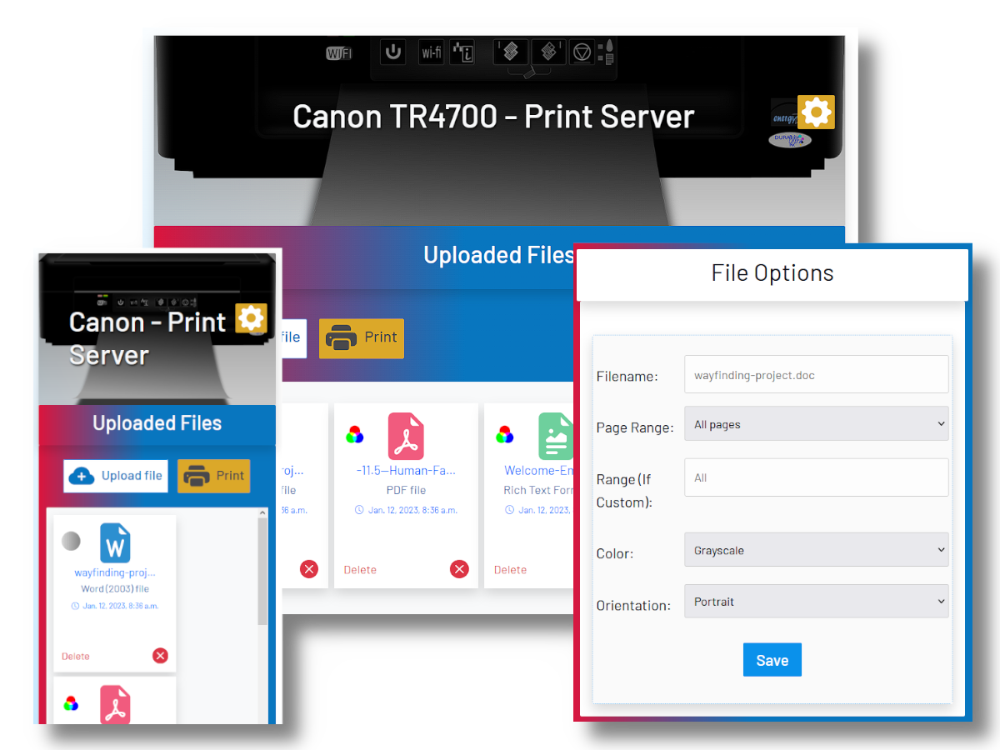
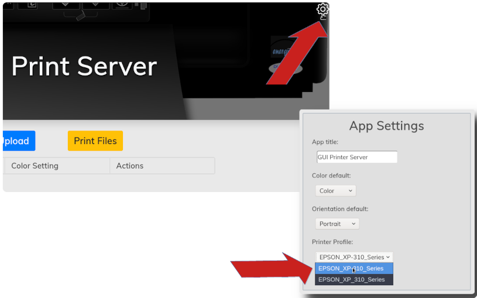

***********
printer-gui
***********

| Django web app for RPi to handle print jobs using a connected
| CUPS printer.

Requirements
############

- Raspberry Pi or similar SBC with networking capability
- Python 3.8.3 and the pip package installer on the SBC's OS.
- A network printer connected on the local network

Limitations
###########
- Currently I have only implemented DOCX and PDF file formats.
- No sessions.

| Because I have not yet implemented sessions, if someone clicks
| "Print Files" while another person on the network is uploading
| some files, whatever that other person has uploaded will print
| and be cleared from the queue as well. Not a big deal in my
| house but I may implement separate sessions in the future to
| address this flaw.

Setup
#####
| Follow the steps below to convert your single-board computer
| into a printer server on your local network.

1) Connect your printer via CUPS
--------------------------------
| On your single-board computer, you will first need to connect
| to your printer using CUPS. I was not in the mood for reading
| command-line documentation and was able to set this up in a
| few minutes using the CUPS web GUI. There are many tutorials
| on how to do this such as `this one <https://www.howtogeek.com/169679/how-to-add-a-printer-to-your-raspberry-pi-or-other-linux-computer/>`_.

2) Install some necessary utilities
-----------------------------------
| My printer server only handles 2 file types: PDF and DOCX.
| DOCX files are actually converted to PDF in order to be printed
| with the 'lp' command-line utility. Perhaps if I get really
| bored, I will look for other conversion tools and rewrite the
| printer/file_printer.py module to support converting JPEGs
| and PNGs. Anyhow, the following utilities need to be installed:
| - pandoc 2.2.1
| - texlive-latex-extra 2018.20190227-2

3) Setup the virtualenv
-----------------------
| You will need to create your Python virtualenv in the root
| directory for this project, activate it and install the
| required packages:

.. code:: bash

    python3 -m venv venv
    source venv/bin/activate
    pip3 install -r requirements.txt

4) Make the DB migrations
-------------------------
| Migrate the database by entering the following commands in this
| project's root directory:

.. code:: bash

    python3 manage.py makemigrations printer --skip-checks
    python3 manage.py migrate --skip-checks

5) Run the initial_setup script
-------------------------------
| This script must be run within the Django shell. With the
| virtualenv enabled (source venv/bin/activate), enter the
| following commands from the root directory of this repository:

.. code:: bash

    python3 manage.py shell
    exec(open('initial_setup.py').read())
    exit()

6) Give your device a static IP
-------------------------------
| You will, of course, need a static IP address. On Raspberry Pi
| OS, you can configure your IP address in /etc/dhcpcd.conf by
| setting "static ip_address", "static domain_name_servers", and
| "static routers". A simple example is given below:

.. code:: bash

    interface wlan0
      static ip_address=192.168.1.133
      static domain_name_servers=192.168.1.1
      static routers=192.168.1.1

7) Add your IP address in printer/settings.py
---------------------------------------------
| Open the settings.py file and enter your server's IP address as
| a string in the ALLOWED_HOSTS list.

8) Configure the scripts
------------------------
| Assuming you have cloned this repository in the '/home/pi'
| directory, you will only need to change the IP address
| in the 'start.bash' script to the static IP address you have
| set. You can run the server by executing this script and enter
| Ctrl-C to exit it:

.. code:: bash

    ./start.bash
    Watching for file changes with StatReloader
    Performing system checks...

    System check identified no issues (0 silenced).
    January 04, 2021 - 17:40:26
    Django version 3.1, using settings 'printer.settings'
    Starting development server at http://192.168.1.133:8000/
    Quit the server with CONTROL-C.

| Assuming the server runs correctly, you may configure the
| server to run automatically on startup as a systemd service.
| On the Raspberry Pi, copy the 'printerserver.service' file
| to '/etc/systemd/system/', start it, and enable it.

.. code:: bash

    sudo cp /home/pi/printer-gui/printerserver.service /etc/systemd/system/
    sudo systemctl start printerserver
    sudo systemctl enable printerserver

| To check the status of the service and debug:

.. code:: bash

    sudo systemctl status printerserver

9) Configure the server to use your printer
-------------------------------------------
| The printer server has not yet been configured to use your
| CUPS printer profile. With the server running, visit its
| URL in a web browser from a device on the same network
| (e.g. http://192.168.1.133:8000). Locate and click the
| settings icon as pictured below:

| As you can see in the picture, you can also set a title and
| defaults for the print server. Now the server should be able
| to print correctly. Upload some test files, configure the
| options, and print out the files if you wish.
